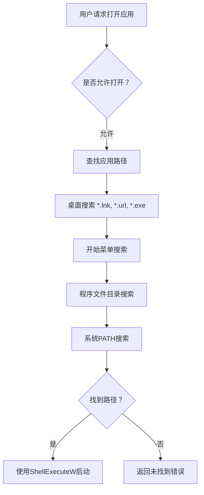

### 🤖 Assistant


# Windows应用启动插件文档

## 概述

本插件为Windows系统设计，旨在解决中文应用启动路径问题，通过智能路径查找和原生Windows API调用，实现可靠的应用启动功能。支持关键词触发（如"打开微信"）和命令触发（如`/open wechat`）两种方式。

## 功能特点

- ✅ **智能路径查找**：自动搜索桌面、开始菜单、程序文件和系统路径
- 🌐 **原生API启动**：使用Windows ShellExecuteW API直接启动应用，避免路径问题
- 🈺 **中文支持**：完美处理中文路径和应用名称
- ⚙️ **权限控制**：支持应用黑白名单管理
- 📊 **日志记录**：详细记录操作过程，便于调试

## 安装与配置

### 系统要求
- Windows 10/11
- Python 3.7+
- 插件系统支持（如自行开发的插件框架）

### 安装步骤

1. 将插件文件复制到插件目录：
   ```
   plugins/
   └── open_appliction_plugin
   ```

2. 创建配置文件 `config.toml`：
   ```toml
   [components]
   enable_open_action = true   # 启用关键词触发
   enable_open_command = true  # 启用命令触发
   
   [open_app]
   list_type = "black"         # 名单类型：black(黑名单)/white(白名单)
   app_list = ["cmd", "regedit"] # 禁止或允许的应用列表
   ```

3. 在系统中注册插件：
   ```python
   # 在插件加载器中
   from plugins.open_app_plugin import OpenApplicationPlugin
   ```

## 使用指南

### 关键词触发
直接发送包含关键词的消息：
```
打开微信
启动计算器
run notepad
open 三角洲行动
```

### 命令触发
使用特定命令格式：
```
/open wechat
/open 计算器
/open "Visual Studio"
```

### 黑白名单配置
- **黑名单模式**（默认）：禁止打开指定应用
  ```toml
  [open_app]
  list_type = "black"
  app_list = ["cmd", "regedit", "taskmgr"]
  ```
  
- **白名单模式**：只允许打开指定应用
  ```toml
  [open_app]
  list_type = "white"
  app_list = ["wechat", "chrome", "notepad"]
  ```

## 技术原理

### 路径查找流程


### 启动机制
使用Windows原生API确保可靠启动：
```c
HINSTANCE ShellExecuteW(
  HWND    hwnd,          // 父窗口句柄（NULL）
  LPCWSTR lpOperation,   // 操作类型（"open"）
  LPCWSTR lpFile,        // 文件路径
  LPCWSTR lpParameters,  // 参数（NULL）
  LPCWSTR lpDirectory,   // 工作目录（NULL）
  INT     nShowCmd       // 显示方式（SW_SHOW=5）
);
```

## 常见问题解决

### 应用无法打开
1. 检查应用是否在黑白名单中
2. 查看日志确认路径查找结果
3. 尝试手动执行路径验证：
   ```python
   from plugins.open_app_plugin import WindowsAppLauncher
   path = WindowsAppLauncher.find_application("应用名称")
   print(f"找到路径: {path}")
   ```

### 路径包含特殊字符
插件自动处理：
- 空格：`C:\Program Files` → 原生API自动处理
- 中文：`C:\用户\张三\桌面\我的应用.lnk`
- 特殊符号：`#`, `&`, `%` 等

### 日志分析
日志中包含关键信息：
```
[INFO] 成功打开应用: 微信 (路径: C:\Users\Admin\Desktop\微信.lnk)
[DEBUG] ShellExecuteW 返回值: 42 (成功>32)
[ERROR] 打开应用失败: photoshop - 未找到应用程序
```

## 贡献与支持

### 问题反馈
遇到问题时，请提供：
1. 应用名称
2. 配置文件内容
3. 相关日志片段
4. 操作系统版本

### 开发贡献
欢迎提交Pull Request：
```bash
git clone https://github.com/your-repo/windows-app-launcher.git
cd windows-app-launcher
# 创建新分支进行开发
git checkout -b feature/new-enhancement
```

## 许可证
MIT License - 自由使用和修改，需保留原始作者信息

> 提示：本插件已针对Windows路径处理进行深度优化，解决了中文路径和特殊字符问题，使用原生API确保最高兼容性。

